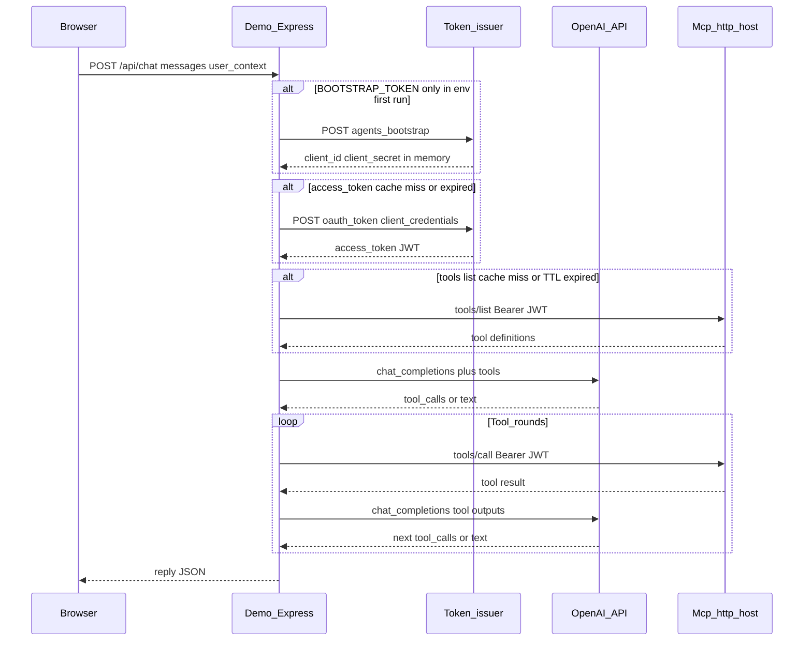
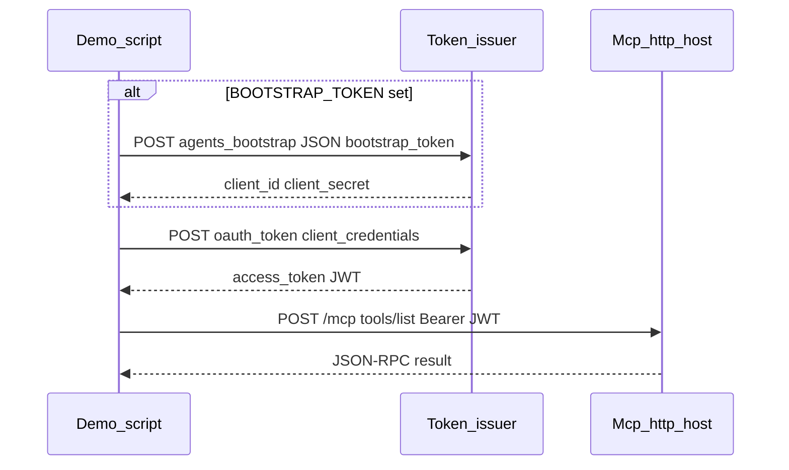

# Architecture — public MCP demo agent

**Extending MCP usage?** See [`MCP_DEVELOPER_GUIDE.md`](./MCP_DEVELOPER_GUIDE.md) for best practices (caching, tokens, scaling).

Two entrypoints:

| npm script | Source | MCP auth |
|------------|--------|----------|
| **`dev`** / **`start`** | [`src/server.ts`](../src/server.ts) | **OAuth2** + **JWT** via [`src/mcp/oauthAccessToken.ts`](../src/mcp/oauthAccessToken.ts) (same Auth service as the CLI script) |
| **`oauth-agent`** / **`bootstrap`** | [`src/index.js`](../src/index.js) | **OAuth2** + **JWT** bearer (same script; **`bootstrap`** is an alias) |

URLs and secrets come from **your admin portal** (or operator doc).

---

## Chat demo: `npm run dev` / `npm start` → [`src/server.ts`](../src/server.ts)

Express serves **`demo.html`** and **`POST /api/chat`** ([`src/chat/chatRoute.ts`](../src/chat/chatRoute.ts)). The server reuses an in-memory **`access_token`** until shortly before OAuth **`expires_in`** ([`src/mcp/oauthAccessToken.ts`](../src/mcp/oauthAccessToken.ts)), and caches MCP **`tools/list`** for a short TTL (default **5 minutes**, env **`MCP_TOOLS_LIST_TTL_MS`**) keyed by bearer token ([`src/mcp/mcpClient.ts`](../src/mcp/mcpClient.ts)). Each MCP **`tools/call`** still opens a short-lived HTTP session (same pattern as before).

### Sequence (browser + OpenAI + OAuth MCP)

### Environment (chat demo — [`.env.example`](../.env.example))

| Variable | Role |
|----------|------|
| **`PUBLIC_SITE_URL`** | Browser origin for links / logs. |
| **`PORT`** | HTTP listen port (default **3847**). |
| **`MCP_ENDPOINT`** | MCP Streamable HTTP URL (typically ends with **`/mcp`**). |
| **`AUTH_BASE_URL`** | Token issuer base URL (no trailing slash). |
| **`CLIENT_ID`** / **`CLIENT_SECRET`** | OAuth2 **`client_credentials`**. |
| **`BOOTSTRAP_TOKEN`** | Optional one-time bootstrap; if **`CLIENT_ID`** / **`CLIENT_SECRET`** are omitted, the first token fetch runs bootstrap and keeps id/secret in memory until process exit. |
| **`OPENAI_API_KEY`** | OpenAI API key (server-side only). |
| **`MCP_TOOLS_LIST_TTL_MS`** | Optional. In-memory **`tools/list`** cache TTL in ms (default **300000**). Use **0** to disable. |

---

## OAuth agent: `npm run oauth-agent` / `npm run bootstrap` → [`src/index.js`](../src/index.js)

Node script: optional **bootstrap** exchange, **`client_credentials`**, then **`tools/list`** with a **JWT** toward **`MCP_ENDPOINT`**. **`npm run bootstrap`** is the same command as **`npm run oauth-agent`**.

### Sequence (bootstrap optional, then OAuth2, then MCP)

Exact paths (`/v1/agents/bootstrap`, `/oauth/token`, etc.) follow **your issuer’s API**; adjust [`src/index.js`](../src/index.js) if your portal differs.

### Environment (`oauth-agent` — same OAuth block as chat)

| Variable | Role |
|----------|------|
| **`AUTH_BASE_URL`** | Token issuer base URL (no trailing slash). |
| **`MCP_ENDPOINT`** | MCP Streamable HTTP endpoint. |
| **`BOOTSTRAP_TOKEN`** | One-time bootstrap from the portal (omit if **`CLIENT_SECRET`** already set). |
| **`CLIENT_ID`** / **`CLIENT_SECRET`** | OAuth2 **`client_credentials`**. |

### Deployment alignment (JWT path)

JWTs must be verifiable by your MCP host: **issuer**, **audience**, and **JWKS** must match your platform’s documentation for the issuer and MCP services.

---

## Security notes

- **OAuth / bootstrap path:** keep **`CLIENT_SECRET`**, bootstrap tokens, and printed payloads out of git and shared logs.
- **Chat demo:** keep **`OPENAI_API_KEY`** and OAuth secrets server-side only.
- **`demo.html`** may load third-party scripts from a CDN; tighten or self-host for stricter deployments.
